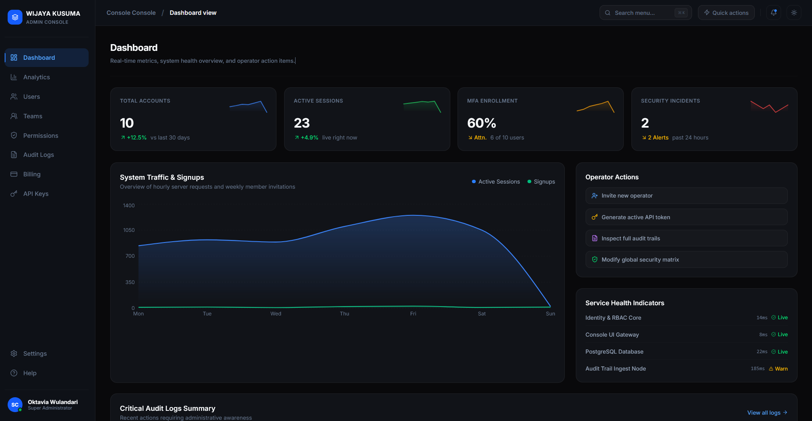

# 🏛️ Wijaya Kusuma - Enterprise Admin Console

[](https://github.com/wijayakusuma)
[](https://github.com/wijayakusuma)
[](https://github.com/wijayakusuma)

A premium, world-class enterprise SaaS Admin Panel focusing on high-security operations, user access governance, compliance audit tracking, and key developer integrations. The workspace incorporates an elegant, dark-first custom design system using Tailwind CSS, Radix UI primitives, Lucide Icons, and beautiful CSS/Motion transitions.

---


## ✨ Key Features & Views

The console is fully modular, dividing administration capabilities into isolated views:

*   **📊 Dashboard & Analytics (`DashboardView.tsx` & `AnalyticsView.tsx`)**
    *   Dynamic dashboards monitoring real-time server load, API traffic, active sessions, and database connections.
    *   Rich data visualizations using `recharts` for tracking billing trends, traffic volumes, and user activity growth.
*   **👥 Interactive User Management (`UsersView.tsx`)**
    *   Complete management portal to invite, edit, suspend, or configure enterprise accounts.
    *   Search and filter integrations to quickly query user details.
*   **🛡️ Dynamic Access Control & RBAC (`PermissionsView.tsx`)**
    *   Role-Based Access Control matrix to easily configure and toggle feature flags and specific access permissions across multiple groups.
*   **🔑 Developer API Key Suite (`ApiKeysView.tsx`)**
    *   Complete management panel for developers to generate, copy, restrict, and rotate API credentials.
*   **💳 Stripe-Style Billing Center (`BillingView.tsx`)**
    *   Visual representation of current account quotas, payment methods, usage logs, and billing history.
*   **📜 Audit Trail & Incident Console (`AuditLogsView.tsx`)**
    *   Detailed compliance log tracker displaying user operations, authorization requests, and system anomalies with colored severity indicators.
*   **👥 Teams & Divisions Portal (`TeamsView.tsx`)**
    *   Organizational chart manager showing team size, project leads, departments, and operations.
*   **⚙️ System Settings (`SettingsView.tsx` & `HelpView.tsx`)**
    *   Global config adjustments, profile preferences, and interactive quick-help FAQ sheets.
*   **⌨️ Command Palette (`command.tsx`)**
    *   Keyboard-friendly command interface accessible via `Cmd+K` or `Ctrl+K` for instant views routing.

---

## 🎨 Design Philosophy & Aesthetics

This project is tailored with high-end dark aesthetics designed to feel premium and sleek:
1.  **Tailored Color Palette**: Built with pure deep-blacks (`#0A0A0C`), sleek dark cards (`#13151A`), crisp borders, and subtle royal blue accent highlights.
2.  **Modern Typography**: Utilizes fluid layout scales and clean fonts optimized for data-dense telemetry interfaces.
3.  **Smooth Micro-Animations**: Features custom CSS keyframe animations (like `fadeIn`, `slideUp`, `scaleIn`) and stagger delay classes (`.stagger-1` to `.stagger-5`) to elevate interface transitions.

---

## 📂 Codebase Directory Structure

```yaml
3.Admin Panel/
├── public/                 # Static assets (Favicons, branding logos)
│   └── favicon1.png        # Current primary web favicon
├── src/
│   ├── main.tsx            # Main bootstrap entry point
│   ├── app/
│   │   ├── App.tsx         # Root container, layout, navigation & sidebar controller
│   │   ├── types.ts        # Common TypeScript interfaces
│   │   ├── components/
│   │   │   └── ui/         # Reusable atomic UI components (Radix UI wrappers)
│   │   │       ├── button.tsx
│   │   │       ├── dialog.tsx
│   │   │       ├── table.tsx
│   │   │       ├── chart.tsx
│   │   │       ├── command.tsx
│   │   │       └── ... (49 UI Primitives)
│   │   └── views/          # Modular administration page components
│   │       ├── DashboardView.tsx
│   │       ├── UsersView.tsx
│   │       ├── PermissionsView.tsx
│   │       └── ...
│   └── styles/             # Modular CSS styling rules
│       ├── theme.css       # Dynamic dark/light colors and base typography layer
│       ├── tailwind.css    # Tailwind injection point
│       └── globals.css     # Global utility classes and page resets
├── package.json            # Dependency manifest
└── vite.config.ts          # Vite compilation config
```

---

## 🚀 Getting Started

Follow these steps to launch the enterprise console locally:

### 1. Prerequisite Installations
Ensure you have **Node.js** (v18+) and **npm** installed on your workstation.

### 2. Install Dependencies
Run the command below in the project root:
```bash
npm install
```

### 3. Launch Development Server
Start the Vite local development instance:
```bash
npm run dev
```
Open [http://localhost:5173](http://localhost:5173) in your browser to inspect the application.

### 4. Build for Production
To build optimized bundles for deployment:
```bash
npm run build
```
The output assets will be created in the `/dist` directory.

---

## 🛠️ Main Technology Stack

*   **Runtime & Builder**: [React 18](https://react.dev/) + [Vite 6](https://vite.dev/)
*   **CSS Framework**: [Tailwind CSS v4](https://tailwindcss.com/)
*   **UI Components**: [Radix UI](https://www.radix-ui.com/)
*   **Icons**: [Lucide React](https://lucide.dev/)
*   **Charts**: [Recharts](https://recharts.org/)
*   **Notifications**: [Sonner](https://sonner.dev/)

---

## 📝 Git Best Practices & Troubleshooting

### Ignoring Unnecessary Files
To keep the repository clean and efficient, make sure you ignore dependencies and build outputs. The project contains a [`.gitignore`](file:///.gitignore) file configured to skip tracking for:
- `node_modules/` (dependencies)
- `dist/` (build artifacts)
- `*.log` (temporary logs)
- `.env*` (sensitive environments)

If you accidentally tracked `node_modules` before configuring `.gitignore`, you can untrack them without deleting files locally by running:
```bash
git rm -r --cached node_modules
```

### Dealing with "LF will be replaced by CRLF" Warnings
When adding files via `git add .` on Windows, you might encounter warnings such as:
> `warning: in the working copy of '...', LF will be replaced by CRLF the next time Git touches it`

**Why this happens:**
- **LF** (Line Feed) is the line ending character for Unix/Linux/macOS systems.
- **CRLF** (Carriage Return Line Feed) is the line ending character for Windows.

Git automatically normalizes line endings between Windows and Unix standards depending on your global settings. This warning is safe to ignore, but you can configure Git's line ending handling globally by running:

```bash
# Recommended for Windows users (converts LF to CRLF on checkout, CRLF to LF on commit)
git config --global core.autocrlf true

# Alternatively, disable warnings for line ending conversions
git config --global core.safecrlf false
```


---

<div align="center">

Made with ❤️ by **Wijaya Kusuma**

</div>
